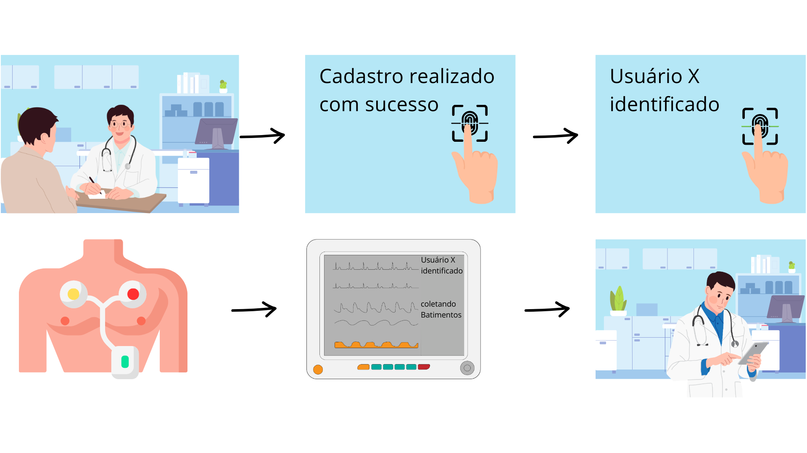
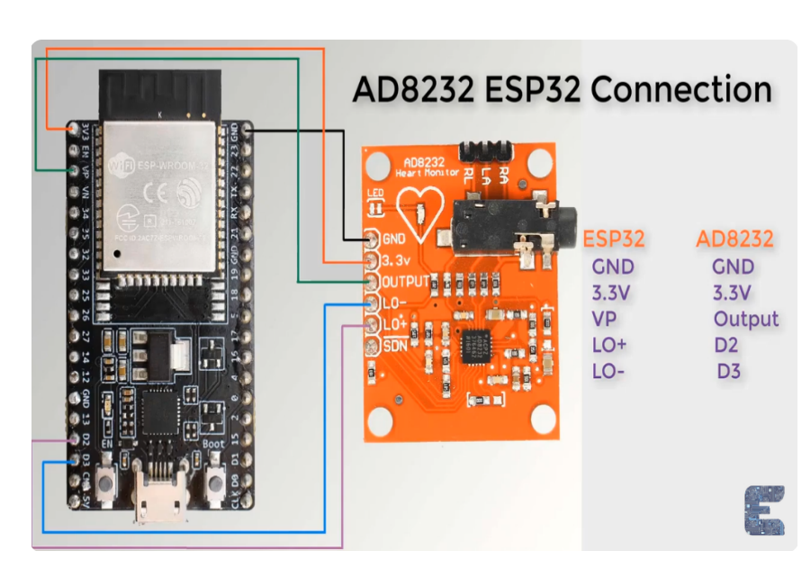
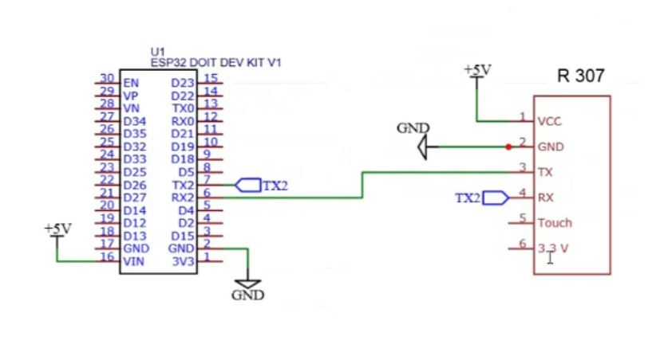

# maloca-das-icoisas-iMIC016-Aula4-DesafioK2
Repositório para Armazenar o Desafio K2 do módulo AVançado do Maloca das iCoisas

## Big Picture

### Storytelling

### Dispositivo Biometria
 
O cadastro do paciente e a leitura da biometria para captar batimentos;

### Sensor de Batimentos 
 
